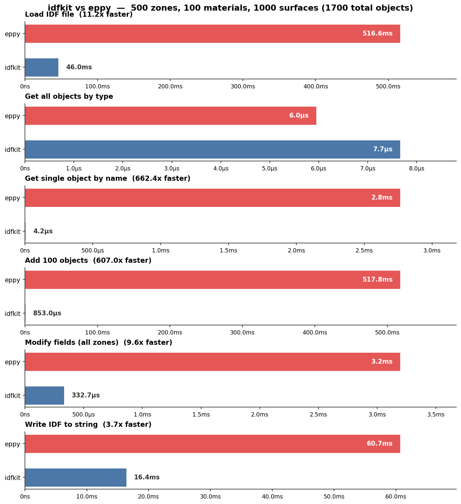

# idfkit

[](https://github.com/samuelduchesne/idfkit/releases)
[](https://github.com/samuelduchesne/idfkit/actions/workflows/main.yml?query=branch%3Amain)
[](https://codecov.io/gh/samuelduchesne/idfkit)
[](https://github.com/samuelduchesne/idfkit/blob/main/LICENSE)

A fast, modern EnergyPlus IDF/epJSON parser with O(1) lookups and reference tracking.

**[Documentation](https://samuelduchesne.github.io/idfkit/)** | **[GitHub](https://github.com/samuelduchesne/idfkit/)**

## Performance

idfkit is designed from the ground up for speed. Benchmarked against
[eppy](https://github.com/santoshphilip/eppy),
[opyplus](https://github.com/openergy/opyplus), and
[energyplus-idd-idf-utilities](https://github.com/Myoldmopar/py-idd-idf) on a
**1,700-object IDF file** (500 zones, 100 materials, 100 constructions, 1,000
surfaces) using EnergyPlus V9.3 - the newest version natively supported by all
four tools:



<details>
<summary>Detailed results</summary>

| Operation | idfkit | eppy | opyplus | idd-idf-utilities |
|---|--:|--:|--:|--:|
| **Load IDF file** | 42.6 ms | 522.8 ms | 138.0 ms | 19.1 ms |
| **Get all objects by type** | 7.7 us | 6.7 us | 19.7 us | 128.0 us |
| **Get single object by name** | 4.0 us | 3.0 ms | 4.4 ms | 141.5 us |
| **Add 100 objects** | 851.7 us | 514.2 ms | 138.2 ms | n/a |
| **Modify fields (all zones)** | 349.6 us | 3.4 ms | 3.8 ms | n/a |
| **Write IDF to string** | 15.5 ms | 59.9 ms | 56.3 ms | 30.7 ms |

</details>

Key architectural advantages:

- **O(1) object lookups** via name-indexed collections (vs O(n) linear scans in
  eppy and opyplus)
- **Streaming regex parser** with memory-mapped I/O for large files
- **`__slots__`-based objects** for low memory overhead
- **epJSON schema** instead of IDD for faster field resolution

<details>
<summary>Supported EnergyPlus versions</summary>

| Tool | Versions | Schema format |
|---|---|---|
| **idfkit** | 8.9 - 25.2 | epJSON schema (bundled, gzip-compressed) |
| **eppy** | 1.1 - 9.2 (bundled IDD); any version with external IDD | IDD file |
| **opyplus** | 8.0 - 9.6, 22.1 - 24.1 | IDD file (bundled) |
| **idd-idf-utilities** | any version up to ~23.2 (IDD parser breaks on 24.1+) | IDD file (external) |

</details>

Benchmarks measured with Python 3.12 on Linux x86_64. Each operation was run 10
times (100 for sub-millisecond ops) and the minimum time is reported. See
[`benchmarks/bench.py`](benchmarks/bench.py) to reproduce.

## Installation

```bash
pip install idfkit
```

Or with [uv](https://docs.astral.sh/uv/):

```bash
uv add idfkit
```

## Usage

```python
import idfkit

# TODO: Add usage examples
```

## Development

This project uses [uv](https://docs.astral.sh/uv/) for dependency management.

### Setup

```bash
# Clone the repository
git clone https://github.com/samuelduchesne/idfkit.git
cd idfkit

# Install dependencies and pre-commit hooks
make install
```

> **Note:** Run `git init -b main` first if you're starting from a cookiecutter template.

### Commands

```bash
make install    # Install dependencies and pre-commit hooks
make check      # Run linting, formatting, and type checks
make test       # Run tests with coverage
make docs       # Serve documentation locally
make docs-test  # Test documentation build
```

### First-time setup for new projects

If you just created this project from the cookiecutter template:

1. Create a GitHub repository with the same name
2. Push your code:

   ```bash
   git init -b main
   git add .
   git commit -m "Initial commit"
   git remote add origin git@github.com:samuelduchesne/idfkit.git
   git push -u origin main
   ```

3. Install dependencies: `make install`
4. Fix formatting and commit:

   ```bash
   git add .
   uv run pre-commit run -a
   git add .
   git commit -m "Apply formatting"
   git push
   ```

For detailed setup instructions, see the [cookiecutter-gi tutorial](https://samuelduchesne.github.io/cookiecutter-gi/tutorial/).


## Releasing

1. Bump the version: `uv version --bump <major|minor|patch>`
2. Commit and push
3. Create a [new release](https://github.com/samuelduchesne/idfkit/releases/new) on GitHub with a tag matching the version (e.g., `1.0.0`)

The GitHub Action will automatically publish to PyPI. See the [publishing guide](https://samuelduchesne.github.io/cookiecutter-gi/features/publishing/) for initial setup.

> **First release?** After the workflow completes, enable GitHub Pages: go to `Settings > Pages` and select the `gh-pages` branch.


## Contributing

Contributions are welcome! Please see [CONTRIBUTING.md](CONTRIBUTING.md) for guidelines.

---

*Built with [cookiecutter-gi](https://github.com/samuelduchesne/cookiecutter-gi)*
