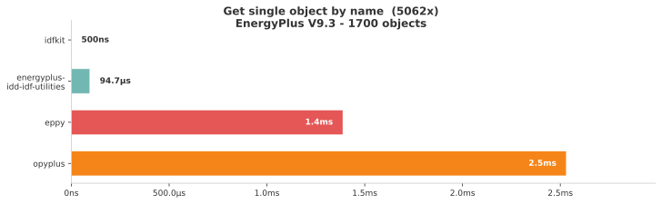

# idfkit

[](https://github.com/samuelduchesne/idfkit/releases)
[](https://github.com/samuelduchesne/idfkit/actions/workflows/main.yml?query=branch%3Amain)
[](https://codecov.io/gh/samuelduchesne/idfkit)
[](https://github.com/samuelduchesne/idfkit/blob/main/LICENSE)

**A fast, modern EnergyPlus IDF/epJSON toolkit for Python.**

idfkit lets you load, create, query, and modify EnergyPlus models with an
intuitive Python API. It is designed as a drop-in replacement for
[eppy](https://github.com/santoshphilip/eppy) with better performance,
built-in reference tracking, and native support for both IDF and epJSON
formats.

## Key Features

- **O(1) object lookups** — Collections are indexed by name, so
  `doc["Zone"]["Office"]` is a dict lookup, not a linear scan.
- **Automatic reference tracking** — A live reference graph keeps track of
  every cross-object reference. Renaming an object updates every field that
  pointed to the old name.
- **IDF + epJSON** — Read and write both formats; convert between them in a
  single call.
- **Schema-driven validation** — Validate documents against the official
  EnergyPlus epJSON schema with detailed error messages.
- **Built-in 3D geometry** — `Vector3D` and `Polygon3D` classes for surface
  area, zone volume, and coordinate transforms without external dependencies.
- **EnergyPlus simulation** — Run simulations as subprocesses with structured
  result parsing, batch processing, and content-addressed caching.
- **Weather data** — Search 55,000+ weather stations, download EPW/DDY files,
  and apply ASHRAE design day conditions.
- **Async & batch simulation** — Run simulations concurrently with
  `async_simulate` or process parameter sweeps with `simulate_batch`.
- **3D visualization** — Render building geometry to interactive 3D views or
  static SVG images with no external tools.
- **Schedule evaluation** — Parse and evaluate EnergyPlus compact, weekly, and
  holiday schedules to time-series values.
- **Thermal properties** — Gas mixture and material thermal calculations for
  glazing and construction analysis.
- **Broad version support** — Bundled schemas for every EnergyPlus release
  from v8.9 through v25.2.

## Performance

idfkit is designed from the ground up for speed. On a **1,700-object IDF**,
looking up a single object by name is **over 750x faster** than eppy and opyplus
thanks to O(1) dict-based indexing:

<picture>
  <source media="(prefers-color-scheme: dark)" srcset="docs/assets/benchmark_dark.svg">
  <source media="(prefers-color-scheme: light)" srcset="docs/assets/benchmark.svg">
  
</picture>

See [full benchmark results](https://samuelduchesne.github.io/idfkit/benchmarks/)
for all six operations (load, get by type, get by name, add, modify, write) across four tools.

## Installation

Requires **Python 3.10+**.

```bash
pip install idfkit
```

Or with [uv](https://docs.astral.sh/uv/):

```bash
uv add idfkit
```

### Optional extras

| Extra | Install command | What it adds |
|-------|----------------|--------------|
| `weather` | `pip install idfkit[weather]` | Refresh weather station indexes from source (openpyxl) |
| `dataframes` | `pip install idfkit[dataframes]` | DataFrame result conversion (pandas) |
| `s3` | `pip install idfkit[s3]` | S3 cloud storage backend (boto3) |
| `plot` | `pip install idfkit[plot]` | Matplotlib plotting |
| `plotly` | `pip install idfkit[plotly]` | Plotly interactive charts |
| `progress` | `pip install idfkit[progress]` | tqdm progress bars for simulations |
| `all` | `pip install idfkit[all]` | Everything above |

## Quick Example

```python
from idfkit import load_idf, write_idf

# Load an existing IDF file
doc = load_idf("in.idf")

# Query objects with O(1) lookups
zone = doc["Zone"]["Office"]
print(zone.x_origin, zone.y_origin)

# Modify a field
zone.x_origin = 10.0

# See what references the zone
for obj in doc.get_referencing("Office"):
    print(obj.obj_type, obj.name)

# Write back to IDF (or epJSON)
write_idf(doc, "out.idf")
```

### Creating a model from scratch

```python
from idfkit import new_document, write_idf

doc = new_document()
doc.add("Zone", "Office", x_origin=0.0, y_origin=0.0)
write_idf(doc, "new_building.idf")
```

## Simulation

```python
from idfkit.simulation import simulate

result = simulate(doc, "weather.epw", design_day=True)

# Query results from the SQLite output
ts = result.sql.get_timeseries(
    variable_name="Zone Mean Air Temperature",
    key_value="Office",
)
print(f"Max temp: {max(ts.values):.1f}°C")
```

> **Note:** `result.sql` requires EnergyPlus to produce SQLite output (the
> default). See the [Simulation Guide](https://samuelduchesne.github.io/idfkit/simulation/)
> for details on output configuration.

## Weather

```python
from idfkit.weather import StationIndex, geocode

index = StationIndex.load()
results = index.nearest(*geocode("Chicago, IL"))
print(results[0].station.display_name)
```

## Documentation

Full documentation is available at
**[samuelduchesne.github.io/idfkit](https://samuelduchesne.github.io/idfkit/)**.

Key sections:

- [Getting Started](https://samuelduchesne.github.io/idfkit/getting-started/installation/) — Installation, quick start, interactive tutorial
- [Simulation Guide](https://samuelduchesne.github.io/idfkit/simulation/) — Run EnergyPlus, parse results, batch processing
- [Weather Guide](https://samuelduchesne.github.io/idfkit/weather/) — Station search, downloads, design days
- [API Reference](https://samuelduchesne.github.io/idfkit/api/document/) — Complete API documentation
- [Migrating from eppy](https://samuelduchesne.github.io/idfkit/migration/) — Side-by-side comparison

## Development

```bash
make install    # Install dependencies and pre-commit hooks
make check      # Run linting, formatting, and type checks
make test       # Run tests with coverage
make docs       # Serve documentation locally
```

## Contributing

Contributions are welcome! Please see [CONTRIBUTING.md](CONTRIBUTING.md) for guidelines.

## License

This project is licensed under the MIT License — see [LICENSE](LICENSE) for details.
